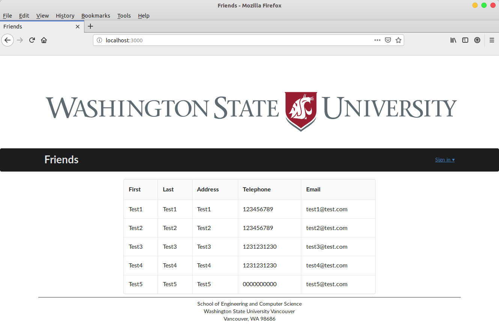

# Friends
The web application is for a user to maintain the contact information of his/her friends. The landing page shows a list of friends with their contact information. The user can Sign-In or Sign-Up for new account to add new contacts or edit the existing ones. No option is avaialbe to delete the current contacts.



The app provides two main functionalities: 1) add a new contact (if the user click on the
"Add Contact" menu); and 2) edit an existing contact (if the user click on the "Edit" option on a specific row)

## Requirements
- [NPM](https://www.npmjs.com/get-npm)
- [Meteor](https://meteor.com)
- Lint

## Installation
- Install NPM if not already installed. 
- Bash installApp.sh in the [app directory](/app).

```shell
$ sudo bash installApp.sh
```
## Usage 

Perform the following commands in the **app** directory. 

Starting the meteor server:
```shell
$ meteor npm run start 
```
Rsetingt Mongo Database 
```shell
$ meteor reset
```

## Structure
```
.
├── app
│   ├── client
│   ├── favicon.ico
│   ├── imports
│   ├── installApp.sh
│   ├── node_modules
│   ├── package.json
│   ├── public
│   └── server
├── config
│   └── settings.development.json
├── Contacts_WebAPP.iml
├── readme.md
└── screenshotHome.png
```

- **app/** : holds the Meteor application sources;
- **config/** : holds configuration files, such as settings.development.json;
- **.gitignore** : don’t commit IntelliJ project files, node_modules, and settings.production.json. The app/ directory has this structure:
- **client/lib/** : holds Semantic-UI files;
- **client/head.html** : the \<head>; 
- **client/main.js** : import all the client-side html and js files;
- **imports/api/** : Define collection processing code (client + server side);
- **imports/startup/** : Define code to run when system starts up (client-only, server-only, both);
- **ui/layouts/** : Layouts contain common elements to all pages (i.e. menubar and footer);
- **ui/pages/** : Pages are navigated to by FlowRouter routes;
- **ui/stylesheets/** : CSS customizations, if any;
- **node_modules/** : managed by Meteor;
- **public/** : static assets (like images) can go here;
- **server/main.js** : import all the server-side js files.

